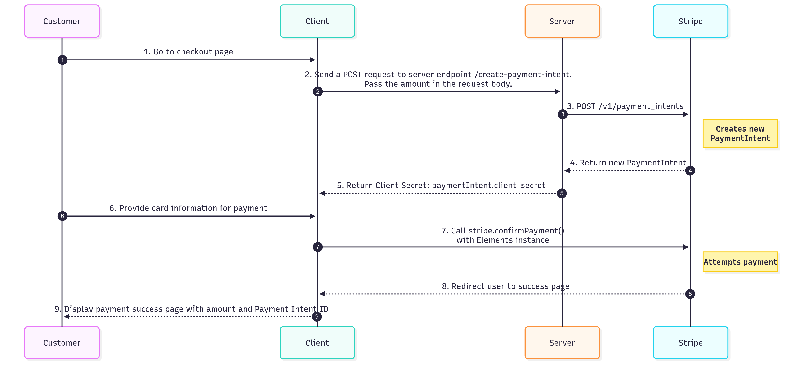
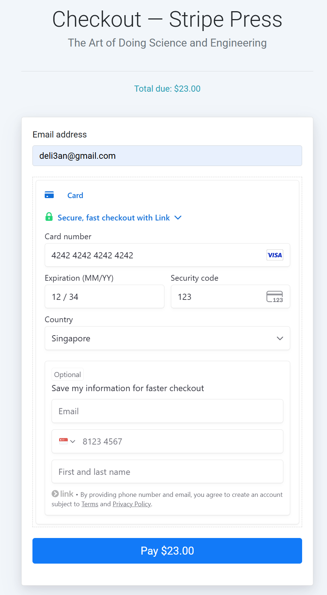

# Delie An's SA technical assessment submission

## How to build, configure and run your application.

This application is developed using the boilerplate application running on Node.js from https://github.com/mattmitchell6/sa-takehome-project-node

To build the application, go to the root folder and run ```npm install```.

To run the application locally, run ```npm start``` in the console.

Open [http://localhost:3000](http://localhost:3000) in the browser to view the application.

## How does the solution work? Which Stripe APIs does it use? How is your application architected?

### How is your application architected?

This architecture uses a client-server model where the express.js backend orchestrates the payment process, while the frontend uses Stripe Payment Element UI to securely handle customer payment details. The transaction is managed by a Payment Intent API.

**Client (Frontend):** A web application built with Handlebars and HTML/CSS/JavaScript that the customer interacts with. It displays the Stripe Payment Element UI and collects the customer's payment information.

**Server (Backend):** An Express.js application running on Node.js. It handles routing and uses the Stripe JavaScript SDK to create PaymentIntents via the Stripe API.

**Stripe:** Stripe provides the secure Payment Element UI, the Payment Intent API, and the infrastructure to handle the payment processing.

### How does the solution work?



(1) Customer goes to checkout page by clicking purchase on a book


(2) The client sends a `POST` request to server at the `/create-payment-intent` endpoint, passing the payment `amount`.

```javascript
async function initialize() {
    const response = await fetch("/create-payment-intent", {
        method: "POST",
        headers: { "Content-Type": "application/json" },
        body: JSON.stringify({ amount: amount }),
    }  
}
```

(3) Server receives the request and the `amount` and creates a Payment Intent using Stripe Payment Intent API. 

```javascript
const paymentIntent = await stripe.paymentIntents.create({
amount: amount,
currency: "sgd",
// In the latest version of the API, specifying the `automatic_payment_methods` parameter is optional because Stripe enables its functionality by default.
automatic_payment_methods: {
  enabled: true,
},
});
```

(4) Stripe returns the PaymentIntent with the `client secret`. 

(5) The server sends the `client secret` to the client.

```javascript
res.send({
clientSecret: paymentIntent.client_secret,
});
```

(6) The client receives the `client secret` by ```const { clientSecret } = await response.json();```

Payment Element is mounted into the checkout page.

```javascript
const paymentElement = elements.create("payment", paymentElementOptions);
paymentElement.mount("#payment-element");
```

The customer fills in the payment details. 



(7) When the payment form is submitted, `stripe.confirmPayment()` on the client collects the payment information the customer entered into the `element` and securely send it to Stripe for processing.

```javascript
async function handleSubmit(e) {
    e.preventDefault();

    const { error } = await stripe.confirmPayment({
        elements,
        confirmParams: {
            return_url: window.location.origin + "/success",
        },
    });
}
```

(8) The customer is redirected to `\success` route after the after the PaymentIntent is confirmed.

```javascript
confirmParams: {
    return_url: window.location.origin + "/success",
},
```

(9) The `success.hbs` displays the payment status message. Total amount of the charge and Stripe Payment Intent ID are discplayed.

```javascript
switch (paymentIntent.status) {
    // Display the payment success message with total amount and payment intent ID
    case 'succeeded':
    statusIcon.innerHTML = `Success`;
    message.innerHTML = `
        <h2>Thank You for Your Purchase!</h2>
        <p>Your payment was successful.</p>
        <p><strong>Total Amount Charged:</strong> ${paymentIntent.currency.toUpperCase()} ${paymentIntent.amount / 100} </p>
        <p><strong>Payment Intent ID:</strong> ${paymentIntent.id}</p>
    `;
    break;
}
```


### Which Stripe APIs does it use?

- Stripe Payment Intents API: [https://docs.stripe.com/api/payment_intents](https://docs.stripe.com/api/payment_intents)  

- Payment Element UI: [https://docs.stripe.com/payments/payment-element](https://docs.stripe.com/payments/payment-element)

## How did you approach this problem? Which docs did you use to complete the project? What challenges did you encounter?

### How did you approach this problem?

**Step 1: Understand the problem from the technical assessment instructions**

The output includes:

- Select a book to purchase.

- Checkout and purchase the item using Stripe Elements.

- Display a confirmation of purchase to the user with the total amount of the charge and Stripe Payment Intent ID (beginning with pi_).

**Step 2: Choose the tech stack, understand the boilerplate application, and set up the environment**

Javascript boilerplate application at [GitHub - mattmitchell6/sa-takehome-project-node: Take home project for Solutions Architect applicants](https://github.com/mattmitchell6/sa-takehome-project-node) was chosen to fast start.

The boilerplate application is built on Handlebars and HTML/CSS/JavaScript. The sample code is understood.

Setup the Node.js environment for the development.

**Step 3: Sign up Stripe account and understand Stripe Payments**

Studied [Stripe Payments](https://docs.stripe.com/payments).

"[Build an advanced integration](https://docs.stripe.com/payments/quickstart): use Stripe Elements to build a customizable payments form and checkout for your customers" was chosen as the assessment instruction specifies Stripe Payment Element instead of Stripe Checkout.

**Step 4: Map the assessment requirement to the payment flow**

The flow is as below and was illustrated in the solution detail at the beginning of this documentation.

1. Customer selects a book and clicks "Checkout."
2. The front makes a create Payment Intent request to the backend.
3. The backend server creates a Payment Intent. It includes the amount. The Stripe API responds with a unique Payment Intent.
4. Stripe returns the Payment Intent with Client Secret.
5. The backend sends the client Secret to the frontend.
6. The frontend uses the initialize and render the Stripe Payment Element - the secure, pre-built UI form for payment details.
7. When the customer clicks "Pay," frontend to securely submit the payment details to Stripe.
8. Stripe processes the payment and redirects the user back to a success page.
9. The success page displays the total amount of the charge and the Payment Intent ID (e.g., pi_123...).

**Step 5: Implementation**

1. Backend Impmentation (Node.js)
   
   Install the Stripe Node library
   
   Implemented `GET /config` to retrieve publishable key from environment variable
   
   Implemented `POST /create-payment-intent` to create Payment Intent
   
   Implemented `GET /success` to route to payment confirmation

2. Frountend Implementation
   
   Implmented  `checkout.js` to pass item amount, create Payment Intent, retrieve Client Secret, mount the Payment Element, and submit the payment
   
   Implemented `success.js` to display the total amount of the charge and the Payment Intent ID when the payment is success and error message otherwise.

**Step 6: Testing**

Used Stripe test cards and other testing payment methods to test the payment flow.

### Which docs did you use to complete the project?

**Docs**

[Get started](https://docs.stripe.com/get-started)

[Accept a payment: Advanced integration](https://docs.stripe.com/payments/accept-a-payment?platform=web&ui=elements#create-the-paymentintent)

[Stripe API Reference](https://docs.stripe.com/api)

[Payment Intent API Reference](https://docs.stripe.com/api/payment_intents/object?lang=node)

[Stripe JS Reference](https://docs.stripe.com/js)

[The Payment Element](https://docs.stripe.com/js/elements_object/create_payment_element)

[Stripe SDK](https://docs.stripe.com/sdks)

**Video**

[Stripe Developers - YouTube](https://www.youtube.com/@StripeDev)

[Accept a payment with the PaymentElement using Node.js - YouTube](https://youtu.be/NZvwxAjptaQ?si=sRTx_Iq9U0pR0LxO)

### What challenges did you encounter?

One challenge I encountered was to pass the payment amount to `/create-payment-intent` to create the Payment Intent. The `/checkout` in `app.js` has already converted the amount to the integer of how much to charge in the smallest currency unit (e.g. 2500 *cents* to charge $25). The following code is added to retrieve the amount from the DOM.

```javascript
const amountElement = document.querySelector(".amount");
const amount = amountElement ? parseInt(amountElement.getAttribute("data-amount")) : 0;
```

The second challenge was to listen to the form submission. The `checkout.hbs` uses `form name="payment-form"`. `document.querySelector('form[name="payment-form"]') ` needs to be used instead of `querySelector("#payment-form")` if the `id="payment-form"` is not added to the form.

The third challenge is the error handling and edge case testing. Simple error handlers have been added to the code. There may be more error scenarios that can happen. They are handled as a default error. 

## How you might extend this if you were building a more robust instance of the same application.

Comprehensive error handling can be implemented to notify the customer more details about the payment errors.

Webhook can be implemented to automate actions after certain event happens. For example, when Stripe successfully processes a payment, it sends this event to the webhook endpoint and automatic fulfilment of the book purchase is triggered.

Other Stripe capabilities can be implmented and extended: Stripe Radar for fraud prevention and Stripe Tax for tax automation.

