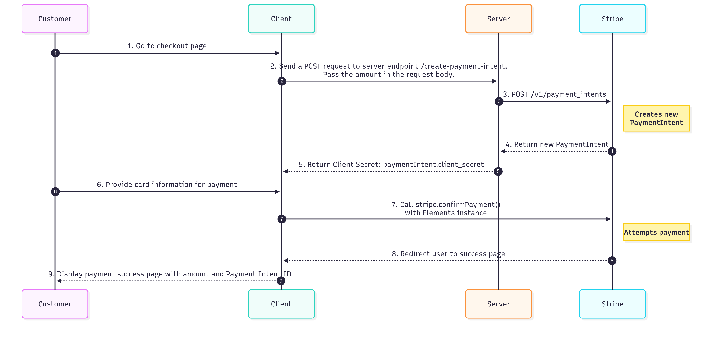
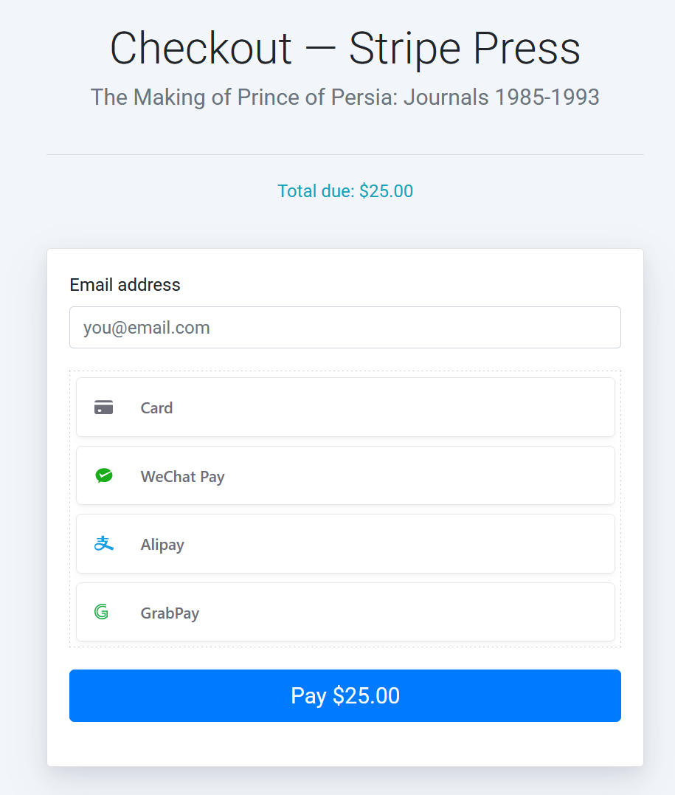
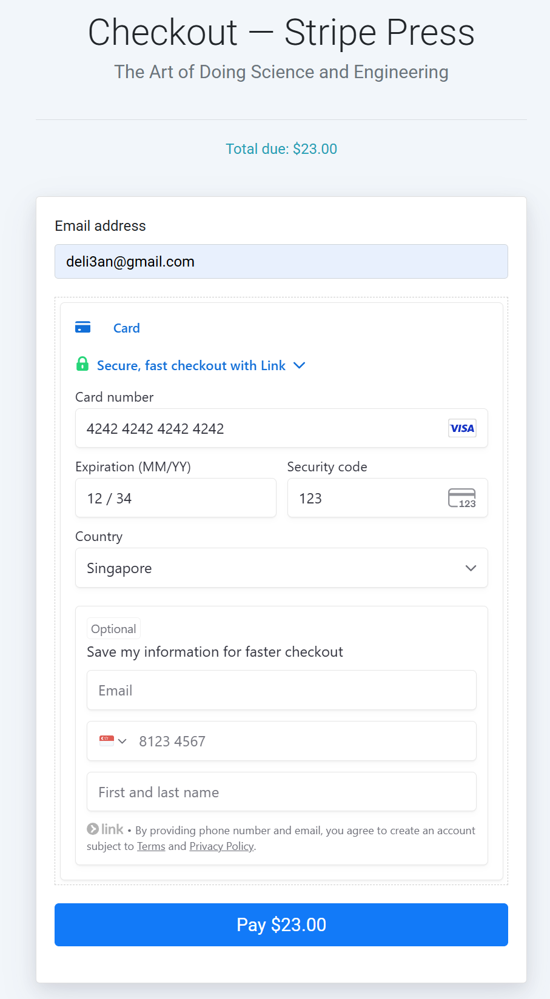

# Delie An's SA technical assessment submission
Credit: This application is developed using the boilerplate application running on Node.js from https://github.com/mattmitchell6/sa-takehome-project-node

## How to build, configure and run your application.
Download and upzip the delie_submission.zip file. 

To build the application, go to the root folder (sa-takehome-project-delie) in your terminal and run ```npm install``` to install the dependencies.

To run the application locally, run ```npm start``` in the terminal.

Once started, open [http://localhost:3000](http://localhost:3000) in the browser to view the application.

## How does the solution work? Which Stripe APIs does it use? How is your application architected?

### How is your application architected?

This application uses a client-server architecture. The express.js backend orchestrates the payment process, while the frontend uses Stripe Payment Element UI to securely handle customer payment details. The transaction is managed by the Payment Intent API.

**Client (Frontend):** A web application built with Handlebars, HTML, CSS, and JavaScript that the customer interacts with. It displays the Stripe Payment Element UI and collects the customer's payment information securely.

**Server (Backend):** An Express.js application running on Node.js. It handles routing and uses the Stripe Node.js SDK to create PaymentIntents via the Stripe API.

**Stripe:** Stripe provides the secure Payment Element UI, the Payment Intent API, and the infrastructure to handle the payment processing.


### How does the solution work?

<div align="center">
    
</div>

(1) The customer clicks "Purchase" on a book to proceed to the checkout page.

<div align="center">
    
</div>
<div align="center">
    
</div>


(2) The client sends a `POST` request to the server at the `/create-payment-intent` endpoint, passing the payment `amount`.

```javascript
async function initialize() {
    const response = await fetch("/create-payment-intent", {
        method: "POST",
        headers: { "Content-Type": "application/json" },
        body: JSON.stringify({ amount: amount }),
    }  
}
```

(3) The server receives the request and the `amount` and creates a Payment Intent using Stripe Payment Intent API. 

```javascript
const paymentIntent = await stripe.paymentIntents.create({
    amount: amount,
    currency: "sgd",
    automatic_payment_methods: {
    enabled: true,
    },
});
```

(4) Stripe returns the Payment Intent with the `client secret`. 

(5) The server sends the `client secret` to the client.

```javascript
res.send({
    clientSecret: paymentIntent.client_secret,
});
```

(6) The client receives the `client secret` by ```const { clientSecret } = await response.json();```

Payment Element is mounted into the checkout page.

```javascript
const paymentElement = elements.create("payment", paymentElementOptions);
paymentElement.mount("#payment-element");
```

The customer fills in the payment details. 

<div align="center">
    
</div>


(7) When the payment form is submitted, `stripe.confirmPayment()` on the client collects the payment information the customer entered into the `element` and securely sends it to Stripe for processing.

```javascript
async function handleSubmit(e) {
    e.preventDefault();

    const { error } = await stripe.confirmPayment({
        elements,
        confirmParams: {
            return_url: window.location.origin + "/success",
        },
    });
}
```

(8) The customer is redirected to `\success` route after the PaymentIntent is confirmed.

```javascript
confirmParams: {
    return_url: window.location.origin + "/success",
},
```

(9) The `success.hbs` with `success.js` displays the payment status message that includes the total amount of the charge and Stripe Payment Intent ID.

```javascript
switch (paymentIntent.status) {
    // Display the payment success message with total amount and payment intent ID
    case 'succeeded':
    statusIcon.innerHTML = `Success`;
    message.innerHTML = `
        <h2>Thank You for Your Purchase!</h2>
        <p>Your payment was successful.</p>
        <p><strong>Total Amount Charged:</strong> ${paymentIntent.currency.toUpperCase()} ${paymentIntent.amount / 100} </p>
        <p><strong>Payment Intent ID:</strong> ${paymentIntent.id}</p>
    `;
    break;
}
```

<div align="center">
    
</div>

### Which Stripe APIs does it use?

- Stripe Payment Intents API: [https://docs.stripe.com/api/payment_intents](https://docs.stripe.com/api/payment_intents)  

- Payment Element UI: [https://docs.stripe.com/payments/payment-element](https://docs.stripe.com/payments/payment-element)


## How did you approach this problem? Which docs did you use to complete the project? What challenges did you encounter?

### How did you approach this problem?

**Step 1: Understand the problem from the technical assessment instructions**

The goal was to build an application that allows a user to

- Select a book to purchase.

- Checkout and purchase the item using Stripe Elements.

- See a confirmation of purchase with the total amount charged and Stripe Payment Intent ID (beginning with pi_).

**Step 2: Choose the tech stack, understand the boilerplate application, and set up the environment**

I chose the Node.js boilerplate application at [GitHub - mattmitchell6/sa-takehome-project-node: Take home project for Solutions Architect applicants](https://github.com/mattmitchell6/sa-takehome-project-node) to fast start.

The boilerplate application is built on Express.js, Handlebars, HTML, CSS, JavaScript. I studied and understood the code.

I set up the Node.js environment for the development.

**Step 3: Sign up Stripe account and understand Stripe Payments**

I studied [Stripe Payments](https://docs.stripe.com/payments) documentation, signed up the Stripe account, retrieved the keys, and configured the payment methods.

I followed the [Build an advanced integration](https://docs.stripe.com/payments/quickstart) quick start guide because the assessment instructions specified using the Stripe Payment Element instead of Stripe Checkout..

**Step 4: Map the assessment requirement to the payment flow**

The payment flow is as below and was illustrated in the solution detail at the beginning of this documentation.

1. Customer selects a book and clicks "Checkout."
2. The frontend sends a request to the backend to create a Payment Intent.
3. The backend server creates a Payment Intent that includes the amount. The Stripe API responds with a unique Payment Intent.
4. The Stripe API returns a unique Payment Intent with Client Secret.
5. The backend sends the client Secret to the frontend.
6. The frontend uses the initialize and render the Stripe Payment Element - a secure, pre-built UI form for collecting payment details.
7. When the customer clicks "Pay", the frontend to securely submits the payment details to Stripe.
8. Stripe processes the payment and redirects the customer to a success page.
9. The success page displays the total amount of the charge and the Payment Intent ID.

**Step 5: Implementation**

1. Backend Implementation (Node.js)
   
   Install the Stripe Node library
   
   Implemented `GET /config` to retrieve publishable key from environment variable
   
   Implemented `POST /create-payment-intent` to create Payment Intent
   
   Implemented `GET /success` to route to payment confirmation

2. Frontend Implementation
   
   Implemented  `checkout.js` to pass item amount, create Payment Intent, retrieve Client Secret, mount the Payment Element, and submit the payment
   
   Implemented `success.js` to display the total amount of the charge and the Payment Intent ID when the payment is successful and error message otherwise.

   Updated `checkout.hbs` and `success.hbs` to import the Stripe.js library and their respective JavaScript files. 

**Step 6: Testing**

Used Stripe test cards and other testing payment methods to test the payment flow.

### Which docs did you use to complete the project?

**Docs**

[Get started](https://docs.stripe.com/get-started)

[Accept a payment: Advanced integration](https://docs.stripe.com/payments/accept-a-payment?platform=web&ui=elements#create-the-paymentintent)

[Build an advanced integration quick start](https://docs.stripe.com/payments/quickstart)

[Stripe API Reference](https://docs.stripe.com/api)

[Payment Intent API Reference](https://docs.stripe.com/api/payment_intents/object?lang=node)

[Stripe JS Reference](https://docs.stripe.com/js)

[The Payment Element](https://docs.stripe.com/js/elements_object/create_payment_element)

[Stripe SDK](https://docs.stripe.com/sdks)

**Video**

[Stripe Developers - YouTube](https://www.youtube.com/@StripeDev)

[Accept a payment with the PaymentElement using Node.js - YouTube](https://youtu.be/NZvwxAjptaQ?si=sRTx_Iq9U0pR0LxO)

### What challenges did you encounter?

**Retrieving the payment amount:** One challenge was passing the payment amount to create the Payment Intent. The `/checkout` in `app.js` has already converted the amount to the smallest currency unit (e.g. $25 to 2500 cents). To retrieve the amount on the client side, I added the following JavaScript to read it from the DOM:

```javascript
const amountElement = document.querySelector(".amount");
const amount = amountElement ? parseInt(amountElement.getAttribute("data-amount")) : 0;
```

**Form submission:** The second challenge was selecting the payment form to listen for its submission event. Since `checkout.hbs` uses `name="payment-form"` instead of `id="payment-form"`. I needed to use `document.querySelector('form[name="payment-form"]') ` rather than `document.querySelector("#payment-form")`.

**Error handling and edge cases:** The third challenge is implementing robust error handling and testing for edge cases. I added simple handlers for common error scenarios. Any unexpected errors are caught and managed by a default error handler. More specific error conditions could be addressed in the future.  

## How you might extend this if you were building a more robust instance of the same application.

**Robust error handling:** Implementing more comprehensive error handling would provide the customers with clear, specific details about why a payment failed, improving the customer experience.

**Webhook integration:** Implementing Webhook integration automates actions and workflow after certain event happens. For example, when Stripe successfully processes a payment, it can send an event to the webhook endpoint and automatically trigger the fulfillment process for the book purchase.

**Additional Stripe features:** Other Stripe capabilities can be implmented, such as Stripe Radar for fraud prevention, Stripe Tax for tax automation, and Stripe Sigma for advanced custom reports.
